# 📚 La CuenterIA

Plataforma web interactiva para crear cuentos infantiles personalizados con ilustraciones generadas mediante inteligencia artificial.

## 📋 Índice

- [🌟 Características](#-características)
- [🚀 Tecnologías](#-tecnologías)
- [🛠️ Instalación](#-instalación)
- [📝 Uso](#-uso)
- [📖 Estructura del Proyecto](#-estructura-del-proyecto)
- [🛠️ Componentes Principales](#-componentes-principales)
- [📊 Flujo de Usuario](#-flujo-de-usuario)
- [🔧 Contextos](#-contextos)
- [🤝 Contribución](#-contribución)
- [📄 Licencia](#-licencia)
- [✨ Créditos](#-créditos)

## 🌟 Características

- **Creación de Personajes**
  - Soporte hasta 3 personajes por cuento
  - Generación de variantes visuales mediante IA
  - Personalización detallada de cada personaje

- **Diseño de Historias**
  - Selección de edad objetivo
  - Múltiples estilos literarios
  - Mensajes centrales personalizables
  - 6-10 páginas por cuento + portada

- **Personalización Visual**
  - Estilos visuales predefinidos
  - Paletas de colores adaptables
  - Formato profesional (20cm x 20cm)

- **Vista Previa Interactiva**
  - Visualización tipo libro
  - Edición de prompts por página
  - Regeneración de imágenes en tiempo real
  - Exportación a PDF

## 🚀 Tecnologías

- **Frontend**
  - React 18 + TypeScript
  - Vite como bundler
  - Tailwind CSS para estilos
  - Lucide Icons para iconografía
  - React Router DOM para navegación

- **Backend**
  - Supabase para autenticación y base de datos
  - API de IA para generación de imágenes

## 🛠️ Instalación

1. Clona el repositorio:
```bash
git clone [url-del-repositorio]
```

2. Instala las dependencias:
```bash
npm install
```

3. Configura las variables de entorno:
```bash
VITE_SUPABASE_URL=tu-url-de-supabase
VITE_SUPABASE_ANON_KEY=tu-anon-key
```

4. Inicia el servidor de desarrollo:
```bash
npm run dev
```

## 📝 Uso

1. Inicia sesión con las credenciales de prueba:
   - Email: demo@lacuenteria.com
   - Contraseña: demo123

2. Sigue el asistente paso a paso:
   - Crea y personaliza los personajes
   - Define la historia y el estilo
   - Ajusta el diseño visual
   - Previsualiza y descarga tu cuento

## 📖 Estructura del Proyecto

```
src/
├── components/         # Componentes React
│   ├── Auth/          # Componentes de autenticación
│   ├── Character/     # Componentes de personajes
│   ├── Layout/        # Componentes de estructura
│   └── Wizard/        # Asistente paso a paso
├── context/           # Contextos de React
├── pages/             # Páginas principales
├── types/             # Definiciones TypeScript
└── main.tsx          # Punto de entrada
```

## 🛠️ Componentes Principales

### Componentes de Personajes
- `CharactersGrid`: Muestra y gestiona la lista de personajes
- `CharacterForm`: Formulario para crear y editar personajes
- `CharacterCard`: Tarjeta individual de personaje

### Componentes de Layout
- `Header`: Barra de navegación superior
- `Sidebar`: Menú lateral de navegación

## 📊 Flujo de Usuario

1. **Autenticación**
   - Inicio de sesión
   - Registro
   - Gestión de sesión

2. **Creación de Personajes**
   - Seleccionar número de personajes
   - Definir características
   - Generar y personalizar imágenes

3. **Diseño de Historia**
   - Definir tema y estilo
   - Estructurar el cuento
   - Personalizar mensajes

4. **Visualización y Exportación**
   - Previsualización tipo libro
   - Ajustes finales
   - Exportación a PDF

## 🔧 Contextos

- `AuthContext`: Manejo de autenticación
- `WizardContext`: Estado y control del asistente

## 🤝 Contribución

Las contribuciones son bienvenidas. Por favor, abre un issue primero para discutir los cambios que te gustaría realizar.

## 🧭 Modo de Trabajo

### 📊 Diagrama de Flujo

```mermaid
graph TD
    A[Linear: Backlog] --> B[Linear: Todo]
    B --> C[Linear: In Progress]
    C --> D[Crear rama feature/*]
    D --> E[Desarrollo]
    E --> F[Crear Pull Request]
    F --> G[Linear: In Review]
    G --> H[Revisar código]
    H --> I[Linear: Ready for merge]
    I --> J[Merge a main]
    J --> K[Linear: Done]
    J --> L[Eliminar rama]
    
    style A fill:#f9f,stroke:#333,stroke-width:2px
    style B fill:#bbf,stroke:#333,stroke-width:2px
    style C fill:#bfb,stroke:#333,stroke-width:2px
    style D fill:#bbf,stroke:#333,stroke-width:2px
    style E fill:#bbf,stroke:#333,stroke-width:2px
    style F fill:#bbf,stroke:#333,stroke-width:2px
    style G fill:#bfb,stroke:#333,stroke-width:2px
    style H fill:#bbf,stroke:#333,stroke-width:2px
    style I fill:#bfb,stroke:#333,stroke-width:2px
    style J fill:#bbf,stroke:#333,stroke-width:2px
    style K fill:#bfb,stroke:#333,stroke-width:2px
    style L fill:#bbf,stroke:#333,stroke-width:2px
```



---

### 📌 Estados de Issues en Linear

## 🧭 Modo de Trabajo

### 📌 Estados de Issues en Linear

| Estado              | Descripción                                                                 |
|---------------------|-----------------------------------------------------------------------------|
| **Backlog**         | Ideas, requerimientos o tareas sin priorización ni planificación.           |
| **Todo**            | Tareas priorizadas listas para ser tomadas en la próxima iteración.         |
| **In Progress**     | Tareas que están siendo desarrolladas activamente.                          |
| **In Review**       | Tareas con código subido, esperando revisión (Pull Request abierto).        |
| **Ready for merge** | Código aprobado, pendiente de merge a `main`.                               |
| **Done**            | Tareas completamente terminadas y desplegadas (si aplica).                  |
| **Canceled**        | Tareas que se descartan por cualquier motivo.                               |

### 🌱 Convención de Ramas en GitHub

| Rama              | Propósito                                                   |
|-------------------|-------------------------------------------------------------|
| `main`            | Rama principal. Código estable y listo para producción.     |
| `feature/*`       | Nuevas funcionalidades.                                     |
| `improvement/*`   | Mejoras no funcionales, refactor, rendimiento, etc.         |
| `bug/*`           | Corrección de errores o regresiones detectadas.             |

> 💡 Cada issue de Linear debe tener su rama asociada.

**Ejemplos:**
- `feature/formulario-login`
- `improvement/ajuste-carga`
- `bug/fix-crash-navegador`

### 🔁 Flujo de Trabajo Integrado

1. **Desde Linear**
   - Se planifican issues desde **Backlog** hacia **Todo**.
   - Cada issue debe tener:
     - Contexto.
     - Objetivo claro.
     - Criterios de éxito y QA.

2. **Inicio de Desarrollo**
   - Al mover un issue a **In Progress**:
     - Crear una nueva rama desde `main`.
     - Nombrar la rama según el tipo (`feature/`, `bug/`, etc.).
     - Asociar el issue en los commits o en la Pull Request.

3. **Pull Request**
   - Al finalizar el desarrollo:
     - Subir la rama y abrir una Pull Request hacia `main`.
     - Mover el issue a **In Review**.
     - Solicitar revisión a un compañero.

4. **Merge y Cierre**
   - Una vez aprobada la PR:
     - Mover el issue a **Ready for merge**.
     - Hacer merge a `main`.
     - Eliminar la rama.
     - Mover el issue a **Done**.

### ✅ Buenas Prácticas

- Una rama = un issue.
- Pull Requests claras: qué se hizo, por qué, y cómo probarlo.
- Eliminar ramas después del merge.
- Si el issue no se ejecutará, mover a **Canceled**.

### ❓ Preguntas Frecuentes

#### ¿Se pierde el historial al borrar una rama?
No. Siempre que hayas hecho merge a `main`, los commits **persisten en el historial**. Lo que se borra es solo el “puntero” de la rama. Aún podrás ver:

- Commits en `git log`.
- Cambios en `git blame`.
- PRs en GitHub.

> ⚠️ Solo pierdes el historial si haces `squash` sin guardar la info, o borras una rama **sin** mergearla.

## 📄 Licencia

[MIT](LICENSE)

## ✨ Créditos

Desarrollado con ❤️ por el equipo de Customware