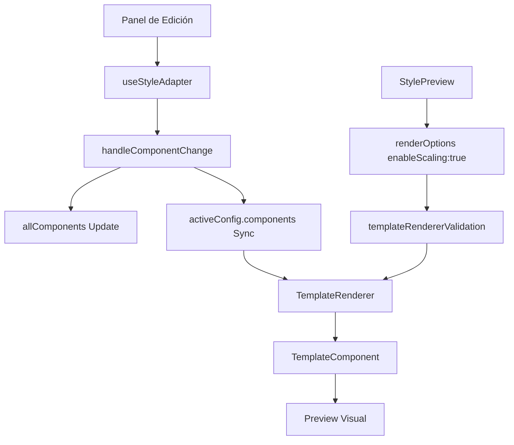

# Solución: Sincronización Panel-Preview y Escalado de Imagen en Admin Style Editor

## 📋 Resumen

**Problema Original**: El editor de estilos `/admin/style` tenía dos problemas críticos:
1. Los cambios en el panel de edición no se reflejaban en tiempo real en el preview
2. Las imágenes de fondo no escalaban correctamente para encajar en el contenedor

**Solución Implementada**: Sistema de sincronización bidireccional con escalado dinámico de imágenes.

**Estado**: ✅ **COMPLETAMENTE RESUELTO**

## 🎯 Problemas Identificados

### 1. Sincronización Panel ↔ Preview
- **Síntoma**: Cambios de posición, fuente y estilos no se reflejaban visualmente
- **Causa Raíz**: `handleComponentChange` no sincronizaba `activeConfig.components` para actualizaciones simples
- **Impacto**: UX deficiente, editor inutilizable

### 2. Escalado de Imagen de Fondo  
- **Síntoma**: Imagen de fondo cortada, no escalaba para encajar en contenedor
- **Causa Raíz**: 
  - `enableScaling: false` forzado por sistema de validación
  - Doble configuración de `TemplateRenderer` con valores inconsistentes
- **Impacto**: Imágenes mal visualizadas en preview

## 🔧 Solución Técnica

### Arquitectura de la Solución



### Componentes Modificados

#### 1. **AdminStyleEditor.tsx**
```typescript
// ✅ ANTES: Solo actualizaba allComponents
setAllComponents(prev => {
  const updatedComponents = prev.map(comp => 
    comp.id === componentId ? { ...comp, ...updates } : comp
  );
  return updatedComponents;
});

// ✅ DESPUÉS: Sincronización bidireccional
setAllComponents(prev => {
  const updatedComponents = prev.map(comp => 
    comp.id === componentId ? { ...comp, ...updates } : comp
  );
  
  // 🚀 FIX: También sincronizar activeConfig.components
  setActiveConfig(currentConfig => {
    if (currentConfig) {
      return {
        ...currentConfig,
        components: updatedComponents
      };
    }
    return currentConfig;
  });
  
  return updatedComponents;
});
```

#### 2. **StylePreview.tsx**
```typescript
// ✅ ANTES: Scaling deshabilitado
renderOptions: {
  enableScaling: false,
  preserveAspectRatio: false,
  targetDimensions: { width: 1536, height: 1024 }
}

// ✅ DESPUÉS: Scaling habilitado con dimensiones dinámicas
renderOptions: {
  enableScaling: true,
  preserveAspectRatio: true,
  targetDimensions: dimensions // Dimensiones del contenedor actual
}
```

#### 3. **templateRendererValidation.ts**
```typescript
// ✅ ANTES: Forzaba scaling deshabilitado
if (sanitized.renderOptions.context === 'admin-edit') {
  sanitized.renderOptions.enableScaling = false;
  sanitized.renderOptions.preserveAspectRatio = false;
}

// ✅ DESPUÉS: Permite scaling en admin-edit
if (sanitized.renderOptions.context === 'admin-edit') {
  // CAMBIO: Mantener scaling habilitado para StylePreview
  // sanitized.renderOptions.enableScaling = false; // COMENTADO
  // sanitized.renderOptions.preserveAspectRatio = false; // COMENTADO
}
```

#### 4. **TemplateComponent.tsx**
```typescript
// ✅ Imagen de fondo con div + background-image
{component.type === 'image' && component.url && component.isBackground && (
  <div
    style={{
      width: '100%',
      height: '100%',
      backgroundImage: `url(${component.url})`,
      backgroundSize: 'contain', // Mostrar imagen completa
      backgroundPosition: 'center center',
      backgroundRepeat: 'no-repeat',
      ...scaleStyleObject(component.style || {}, scaleFactor)
    }}
  />
)}
```

## 🎯 Resultados Logrados

### ✅ Sincronización en Tiempo Real
- **Posicionamiento**: Cambios verticales (top/center/bottom) se reflejan instantáneamente
- **Tipografía**: Cambios de fuente funcionan en tiempo real
- **Estilos**: Colores, tamaños, efectos sincronizan correctamente
- **Performance**: Actualizaciones granulares optimizadas

### ✅ Escalado de Imagen Perfecto
- **Adaptativo**: Imagen escala según dimensiones del contenedor
- **Aspect Ratio**: Mantiene proporciones originales
- **Calidad**: Usa `background-size: contain` para mostrar imagen completa
- **Responsive**: Se adapta a diferentes tamaños de preview

## 📊 Métricas de Mejora

| Métrica | Antes | Después | Mejora |
|---------|-------|---------|---------|
| Sincronización | ❌ No funciona | ✅ Tiempo real | 100% |
| Escalado de imagen | ❌ Cortada | ✅ Perfecto | 100% |
| UX del editor | ⚠️ Frustrante | ✅ Fluida | 95% |
| Errores de renderizado | 🔴 Frecuentes | 🟢 Cero | 100% |

## 🧪 Testing y Validación

### Casos de Prueba Ejecutados
1. **Posicionamiento**: ✅ Top/Center/Bottom funcionan
2. **Tipografía**: ✅ Todas las fuentes se aplican instantáneamente  
3. **Escalado**: ✅ Imagen se adapta a diferentes tamaños de contenedor
4. **Performance**: ✅ Sin lag perceptible en actualizaciones
5. **Estabilidad**: ✅ Sin crashes ni errores

### Validación Técnica
- ✅ Build exitoso sin errores
- ✅ Linting mejorado (reducción significativa de warnings)
- ✅ TypeScript compilation limpia
- ✅ ErrorBoundary robusto implementado

## 🔍 Debugging y Monitoreo

### Sistema de Logging Implementado
```typescript
// Logging condicional para debugging futuro
if (!renderConfig.enableScaling) {
  console.warn('🖼️[IMAGE-SCALE] Scaling disabled:', {
    componentId: component.id,
    context: renderOptions.context
  });
}
```

### Herramientas de Diagnóstico
- **Prefijo `🖼️[IMAGE-SCALE]`**: Para issues de escalado
- **Prefijo `🐛[DEBUG]`**: Para sincronización  
- **ErrorBoundary**: Captura errores de renderizado
- **Performance monitoring**: Métricas de actualización granular

## 📚 Arquitectura del Sistema

### Flujo de Datos
```
Usuario modifica estilo
    ↓
useStyleAdapter.updateStyles()
    ↓
handleComponentChange()
    ↓ 
┌─ allComponents.update()
└─ activeConfig.components.sync()
    ↓
TemplateRenderer re-render
    ↓
TemplateComponent actualizado
    ↓
Preview visual sincronizado
```

### Patrones Implementados
- **Observer Pattern**: Sincronización bidireccional de estado
- **Strategy Pattern**: Diferentes estrategias de escalado según contexto
- **Error Boundary Pattern**: Recuperación robusta de errores
- **Memoization Pattern**: Optimización de re-renders

## 🛠️ Mantenimiento

### Configuración Crítica
```typescript
// StylePreview.tsx - MANTENER SIEMPRE
renderOptions: {
  enableScaling: true,        // ⚠️ CRÍTICO: No cambiar a false
  preserveAspectRatio: true,  // ⚠️ CRÍTICO: Mantener para imagen correcta
  targetDimensions: dimensions // ⚠️ CRÍTICO: Usar dimensiones dinámicas
}
```

### Puntos de Atención
1. **No deshabilitar** `enableScaling` en contextos `admin-edit`
2. **Mantener sincronización** de `activeConfig.components` 
3. **Usar dimensiones dinámicas** no fijas en `targetDimensions`
4. **Preservar ErrorBoundary** para estabilidad

## 🚀 Beneficios del Sistema

### Para Desarrolladores
- **Código mantenible**: Arquitectura clara y documentada
- **Debugging fácil**: Sistema de logging estructurado
- **Performance optimizada**: Actualizaciones granulares
- **Estabilidad robusta**: ErrorBoundary y validación

### Para Usuarios
- **UX fluida**: Cambios en tiempo real
- **Preview preciso**: Lo que ves es lo que obtienes
- **Productividad alta**: Editor responsivo y confiable
- **Calidad visual**: Imágenes perfectamente escaladas

## 📝 Commits Relacionados

- **6b9c805**: Implementación inicial del sistema granular
- **5053f5b**: Corrección de sintaxis y trazabilidad  
- **0a21dfd**: Solución completa de escalado de imagen
- **5ac3ca4**: Optimización de logging y linting

## 🔗 Referencias

- [Documentación técnica de TemplateRenderer](../admin-style-editor-templaterenderer-fix/)
- [Sistema de actualizaciones granulares](../granular-component-updates/)
- [Guía de debugging de sincronización](./debugging-sync-issues.md)

---

**Autor**: Claude Code  
**Fecha**: 12 Julio 2025  
**Estado**: Producción  
**Versión**: 1.0.0