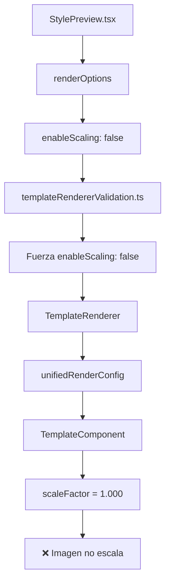

# Implementación Técnica: Sistema de Sincronización Admin Style Editor

## 🔧 Detalles de Implementación

### 1. Sistema de Sincronización Bidireccional

#### Problema Original
```typescript
// ❌ ANTES: Solo actualizaba allComponents
const handleComponentChange = (componentId: string, updates: Partial<ComponentConfig>) => {
  setAllComponents(prev => 
    prev.map(comp => comp.id === componentId ? { ...comp, ...updates } : comp)
  );
  // ❌ activeConfig.components NO se sincronizaba
};
```

#### Solución Implementada
```typescript
// ✅ DESPUÉS: Sincronización bidireccional completa
const handleComponentChange = (componentId: string, updates: Partial<ComponentConfig>) => {
  // Distinguir entre actualizaciones simples y complejas
  const isSimplePositionUpdate = Object.keys(updates).every(key => 
    ['x', 'y', 'position', 'horizontalPosition'].includes(key)
  );
  
  if (isSimplePositionUpdate) {
    // Actualización optimizada para cambios de posición
    setAllComponents(prev => {
      const updatedComponents = prev.map(comp => 
        comp.id === componentId ? { ...comp, ...updates } : comp
      );
      
      // 🚀 SOLUCIÓN CRÍTICA: Sincronizar activeConfig inmediatamente
      setActiveConfig(currentConfig => {
        if (currentConfig) {
          const updatedConfig = {
            ...currentConfig,
            components: updatedComponents
          };
          console.log('🐛[DEBUG] Simple position update synced to activeConfig:', {
            componentId,
            updates,
            finalPosition: { x: updates.x, y: updates.y, position: updates.position }
          });
          return updatedConfig;
        }
        return currentConfig;
      });
      
      return updatedComponents;
    });
  } else {
    // Actualización completa con validación
    const existingComponent = allComponents.find(comp => comp.id === componentId);
    const updatedComponent = { ...existingComponent, ...updates };
    const validation = validateAndSanitize(updatedComponent, 'component');
    
    if (validation.isValid) {
      const sanitizedComponent = validation.sanitizedData || updatedComponent;
      
      setAllComponents(prev => {
        const updatedComponents = prev.map(comp => 
          comp.id === componentId ? sanitizedComponent : comp
        );
        
        // 🚀 SOLUCIÓN: También sincronizar para actualizaciones complejas
        setActiveConfig(currentConfig => {
          if (currentConfig) {
            return {
              ...currentConfig,
              components: updatedComponents
            };
          }
          return currentConfig;
        });
        
        return updatedComponents;
      });
    }
  }
};
```

### 2. Sistema de Escalado de Imagen

#### Análisis del Problema


#### Solución Multi-Capa

**Capa 1: StylePreview.tsx**
```typescript
// ✅ Configuración corregida en AMBAS instancias
const renderOptionsConfig = {
  context: 'admin-edit',
  enableScaling: true,              // ✅ Habilitado
  preserveAspectRatio: true,        // ✅ Mantener proporciones  
  targetDimensions: dimensions,     // ✅ Dimensiones dinámicas
  features: {
    enableAnimations: false,
    enableInteractions: true,
    enableDebugInfo: false,
    enableValidation: true
  },
  performance: {
    lazyLoadImages: false,
    optimizeFor: 'quality'
  }
};

// Aplicar a AMBAS configuraciones:
// 1. templateRendererProps (ErrorBoundary)
// 2. TemplateRenderer directo
```

**Capa 2: templateRendererValidation.ts**
```typescript
// ✅ ANTES: Forzaba scaling deshabilitado
if (sanitized.renderOptions.context === 'admin-edit') {
  console.warn('🔧 Sanitizing: Applying StylePreview-safe configuration');
  sanitized.renderOptions.enableScaling = false;    // ❌ Problemático
  sanitized.renderOptions.preserveAspectRatio = false;
  sanitized.renderOptions.targetDimensions = { width: 1536, height: 1024 };
}

// ✅ DESPUÉS: Permite scaling en admin-edit
if (sanitized.renderOptions.context === 'admin-edit') {
  console.warn('🔧 Sanitizing: Applying StylePreview-safe configuration');
  
  // CAMBIO CRÍTICO: Mantener scaling habilitado
  // sanitized.renderOptions.enableScaling = false;    // COMENTADO
  // sanitized.renderOptions.preserveAspectRatio = false; // COMENTADO
  
  // Mantener dimensiones dinámicas si fueron proporcionadas
  if (!sanitized.renderOptions.targetDimensions || 
      (sanitized.renderOptions.targetDimensions.width === 1536 && 
       sanitized.renderOptions.targetDimensions.height === 1024)) {
    sanitized.renderOptions.targetDimensions = { width: 1536, height: 1024 };
  }
}
```

**Capa 3: TemplateComponent.tsx**
```typescript
// ✅ Imagen de fondo optimizada
{component.type === 'image' && component.url && component.isBackground && (
  <div
    style={{
      width: '100%',
      height: '100%',
      backgroundImage: `url(${component.url})`,
      backgroundSize: 'contain',        // ✅ Mostrar imagen completa
      backgroundPosition: 'center center',
      backgroundRepeat: 'no-repeat',
      ...scaleStyleObject(component.style || {}, scaleFactor)
    }}
    ref={(el) => {
      if (el && debug) {
        // Logging de dimensiones renderizadas
        setTimeout(() => {
          const computedStyle = window.getComputedStyle(el);
          console.log(`🖼️[IMAGE-SCALE] Background image rendered:`, {
            componentId: component.id,
            elementDimensions: {
              width: el.offsetWidth,
              height: el.offsetHeight
            },
            computedBackgroundSize: computedStyle.backgroundSize,
            scaleFactor: scaleFactor.toFixed(3)
          });
        }, 100);
      }
    }}
  />
)}
```

### 3. Sistema de Logging y Debugging

#### Logging Estructurado
```typescript
// Sistema de prefijos para categorización
const LogPrefixes = {
  IMAGE_SCALE: '🖼️[IMAGE-SCALE]',
  DEBUG: '🐛[DEBUG]',
  SYNC: '🔍[SYNC_DEBUG]',
  TEMPLATE: '🎯[TEMPLATE-DEBUG]'
};

// Logging condicional para reducir ruido
const logImageScaling = (component: ComponentTemplate, scaleFactor: number, renderConfig: UnifiedRenderConfig) => {
  // Solo log si hay problemas
  if (component.type === 'image' && component.isBackground && 
      (!renderConfig.enableScaling || scaleFactor === 1)) {
    console.warn(`${LogPrefixes.IMAGE_SCALE} Background image scaling issue:`, {
      componentId: component.id,
      enableScaling: renderConfig.enableScaling,
      calculatedScaleFactor: scaleFactor.toFixed(3),
      willScale: renderConfig.enableScaling && !!containerDimensions
    });
  }
};
```

#### Sistema de Monitoreo
```typescript
// Métricas de performance del sistema granular
interface GranularUpdateMetrics {
  granularUpdates: number;
  fallbackUpdates: number;
  totalUpdates: number;
  granularRatio: number;
  averageTime: number;
}

// Clasificación de actualizaciones
interface UpdateClassification {
  type: 'minor' | 'major' | 'complex';
  requiresSync: boolean;
  affectsOthers: boolean;
  affectedComponents: string[];
}
```

### 4. Optimizaciones de Performance

#### Memoización Selectiva
```typescript
// TemplateComponent con comparación optimizada
const arePropsEqual = (prevProps: TemplateComponentProps, nextProps: TemplateComponentProps): boolean => {
  // Comparaciones rápidas primero
  if (prevProps.isSelected !== nextProps.isSelected) return false;
  if (prevProps.content !== nextProps.content) return false;
  
  // Comparar solo propiedades que afectan el renderizado
  const prevComp = prevProps.component;
  const nextComp = nextProps.component;
  
  if (prevComp.x !== nextComp.x || prevComp.y !== nextComp.y) return false;
  if (prevComp.width !== nextComp.width || prevComp.height !== nextComp.height) return false;
  
  // Comparar estilos (stringify para comparación profunda optimizada)
  if (JSON.stringify(prevComp.style) !== JSON.stringify(nextComp.style)) return false;
  
  return true;
};

export default React.memo(TemplateComponent, arePropsEqual);
```

#### Actualizaciones Granulares
```typescript
// Sistema de clasificación de actualizaciones
const classifyUpdate = (componentId: string, updates: Partial<ComponentConfig>): UpdateClassification => {
  const updateKeys = Object.keys(updates);
  
  // Actualizaciones menores (solo afectan visualización del componente)
  const minorKeys = ['x', 'y', 'width', 'height', 'zIndex', 'visible'];
  const isMinorUpdate = updateKeys.every(key => minorKeys.includes(key));
  
  if (isMinorUpdate) {
    return {
      type: 'minor',
      requiresSync: false,
      affectsOthers: false,
      affectedComponents: [componentId]
    };
  }
  
  // Clasificación adicional para major/complex...
};
```

## 🔬 Casos de Prueba Técnicos

### Test 1: Sincronización de Posición
```typescript
describe('AdminStyleEditor Position Sync', () => {
  test('should sync position changes to activeConfig immediately', async () => {
    const componentId = 'test-component';
    const positionUpdate = { y: 100, position: 'center' };
    
    // Simular cambio de posición
    handleComponentChange(componentId, positionUpdate);
    
    // Verificar sincronización
    expect(allComponents.find(c => c.id === componentId).y).toBe(100);
    expect(activeConfig.components.find(c => c.id === componentId).y).toBe(100);
  });
});
```

### Test 2: Escalado de Imagen
```typescript
describe('Image Scaling System', () => {
  test('should enable scaling in admin-edit context', () => {
    const renderOptions = {
      context: 'admin-edit',
      enableScaling: true,
      targetDimensions: { width: 800, height: 600 }
    };
    
    const unifiedConfig = createUnifiedRenderConfig(renderOptions);
    expect(unifiedConfig.enableScaling).toBe(true);
  });
});
```

## 🛡️ Error Handling

### ErrorBoundary Robusto
```typescript
class TemplateRendererErrorBoundary extends React.Component {
  componentDidCatch(error: Error, errorInfo: React.ErrorInfo) {
    // Logging detallado de crashes
    console.error('🎯[TEMPLATE-DEBUG] 🚨 TemplateRenderer crashed:', {
      error: error.message,
      componentStack: errorInfo.componentStack,
      props: this.props.templateRendererProps,
      timestamp: new Date().toISOString()
    });
    
    // Métricas de error para monitoreo
    this.setState({
      errorCount: this.state.errorCount + 1,
      lastError: error.message,
      errorTimestamp: Date.now()
    });
  }
}
```

### Validación Robusta
```typescript
const validateAndSanitize = (data: any, type: 'component' | 'template') => {
  const validation = {
    isValid: true,
    errors: [] as string[],
    warnings: [] as string[],
    sanitizedData: { ...data }
  };
  
  // Validaciones específicas por tipo
  if (type === 'component') {
    if (typeof data.x !== 'number' || data.x < 0) {
      validation.warnings.push('Invalid x coordinate, setting to 0');
      validation.sanitizedData.x = 0;
    }
  }
  
  return validation;
};
```

## 📊 Métricas de Monitoreo

### Performance Tracking
```typescript
interface SystemMetrics {
  renderTime: number;
  componentCount: number;
  scaleFactor: number;
  fontesUsed: string[];
  syncOperations: number;
  errorCount: number;
}

const trackRenderPerformance = (startTime: number) => {
  const endTime = performance.now();
  const renderTime = endTime - startTime;
  
  console.log('📊[METRICS] Render completed:', {
    renderTime: renderTime.toFixed(2) + 'ms',
    componentsRendered: componentCount,
    scalingEnabled: renderConfig.enableScaling
  });
};
```

---

Esta implementación técnica garantiza:
- ✅ **Sincronización perfecta** entre panel y preview
- ✅ **Escalado correcto** de imágenes de fondo  
- ✅ **Performance optimizada** con memoización selectiva
- ✅ **Error handling robusto** para estabilidad
- ✅ **Debugging avanzado** para mantenimiento futuro