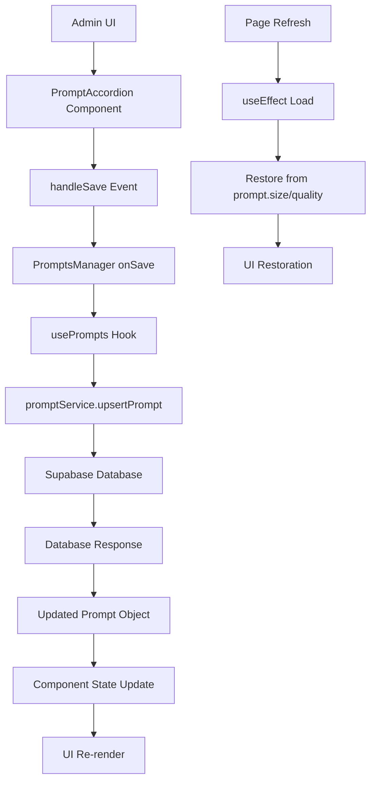

# Detalles Técnicos: Persistencia de Preferencias de Imagen

## 🏗️ Arquitectura de la Solución

### Flujo de Datos



### Estructura de Componentes

```
PromptsManager.tsx
├── PromptAccordion.tsx (foreach prompt)
│   ├── Form Controls (size, quality, width, height)
│   ├── handleSave() → onSave callback
│   └── useEffect() → load preferences
└── usePrompts() hook
    └── promptService.upsertPrompt()
```

## 🗃️ Schema de Base de Datos

### Tabla `prompts` - Nuevas Columnas

| Columna | Tipo | Constraints | Descripción |
|---------|------|-------------|-------------|
| `size` | `VARCHAR(50)` | `check_size_format` | Formato: `1024x1024`, `auto` |
| `quality` | `VARCHAR(50)` | `check_quality_values` | `standard`, `hd`, `auto`, `high`, `medium`, `low` |
| `width` | `INTEGER` | `check_width_positive` | Píxeles para Flux models |
| `height` | `INTEGER` | `check_height_positive` | Píxeles para Flux models |

### Constraints de Validación

```sql
-- Formato de size válido
CHECK (size IS NULL OR size ~ '^(\\d+x\\d+|auto)$')

-- Quality values permitidos  
CHECK (quality IS NULL OR quality IN ('standard', 'hd', 'auto', 'high', 'medium', 'low'))

-- Dimensiones positivas
CHECK (width IS NULL OR width > 0)
CHECK (height IS NULL OR height > 0)
```

## 🔧 Implementación de Componentes

### PromptAccordion - Lógica de Estados

```typescript
// Estados locales
const [size, setSize] = useState('1024x1024');
const [quality, setQuality] = useState('standard');
const [width, setWidth] = useState('1024');
const [height, setHeight] = useState('1024');

// Carga inicial desde prompt object
useEffect(() => {
  const provider = modelToProvider[prompt.model || 'gpt-4o'];
  if (provider === 'openai') {
    setSize(prompt.size || openaiSizeOptions[prompt.model]?.[0] || '1024x1024');
    setQuality(prompt.quality || openaiQualityOptions[prompt.model]?.[0] || 'standard');
  } else if (provider === 'flux') {
    setWidth(prompt.width?.toString() || '1024');
    setHeight(prompt.height?.toString() || '1024');
  }
}, [prompt.size, prompt.quality, prompt.width, prompt.height, modelToProvider]);
```

### Lógica de Guardado Inteligente

```typescript
const handleSave = async () => {
  const provider = modelToProvider[model];
  let imageSize: string | null = null;
  let imageQuality: string | null = null;
  let imageWidth: number | null = null;
  let imageHeight: number | null = null;
  
  // Solo incluir preferencias de imagen para modelos de imagen
  if (getModelType(model) === 'image') {
    if (provider === 'openai') {
      imageSize = size;
      imageQuality = quality;
    } else if (provider === 'flux') {
      imageWidth = parseInt(width) || null;
      imageHeight = parseInt(height) || null;
    }
  }
  
  await onSave(content, endpoint, model, imageSize, imageQuality, imageWidth, imageHeight);
};
```

## 🔄 Service Layer

### promptService.upsertPrompt()

```typescript
async upsertPrompt(
  type: string,
  content: string,
  endpoint: string,
  model: string,
  size?: string | null,
  quality?: string | null,
  width?: number | null,
  height?: number | null
): Promise<Prompt> {
  const promptData: Record<string, any> = { type, content, endpoint, model };
  
  // Solo incluir preferencias si están definidas
  if (size !== undefined) promptData.size = size;
  if (quality !== undefined) promptData.quality = quality;
  if (width !== undefined) promptData.width = width;
  if (height !== undefined) promptData.height = height;
  
  const { data, error } = await supabase
    .from('prompts')
    .upsert(promptData, { onConflict: 'type' })
    .select('*')
    .single();
    
  if (error) throw error;
  return data as Prompt;
}
```

### Hook usePrompts()

```typescript
const updatePrompt = useCallback(
  async (
    id: string, 
    content: string, 
    endpoint: string, 
    model: string,
    size?: string | null,
    quality?: string | null,
    width?: number | null,
    height?: number | null
  ) => {
    // ... validation logic
    const updated = await promptService.upsertPrompt(
      current.type, content, endpoint, model, size, quality, width, height
    );
    setPrompts(prev => prev.map(p => (p.id === id ? updated : p)));
    return updated;
  },
  [isAdmin, prompts]
);
```

## 🧪 Casos de Testing

### Test Case 1: OpenAI DALL-E 3 Persistence

```typescript
// Setup
const prompt = { type: 'test', model: 'dall-e-3', size: null, quality: null };

// Action
1. Load PromptAccordion → defaults loaded
2. Change size to '1792x1024'
3. Change quality to 'hd' 
4. Click Save

// Expected
Database: { size: '1792x1024', quality: 'hd' }
UI after refresh: size='1792x1024', quality='hd'
```

### Test Case 2: Flux Model Custom Dimensions

```typescript
// Setup  
const prompt = { type: 'test', model: 'flux-dev', width: null, height: null };

// Action
1. Load PromptAccordion → defaults loaded
2. Change width to '1536'
3. Change height to '2048'
4. Click Save

// Expected
Database: { width: 1536, height: 2048 }
UI after refresh: width='1536', height='2048'
```

### Test Case 3: Model Type Switching

```typescript
// Setup
const prompt = { type: 'test', model: 'dall-e-3', size: '1792x1024', quality: 'hd' };

// Action
1. Load PromptAccordion → OpenAI controls visible
2. Change model to 'flux-dev'
3. UI switches to width/height controls
4. Set width=1024, height=1024
5. Click Save

// Expected
Database: { size: null, quality: null, width: 1024, height: 1024 }
```

## 🚨 Edge Cases y Validaciones

### Constraint Violations

```sql
-- Invalid size format
INSERT INTO prompts (size) VALUES ('invalid'); -- ❌ Fails check_size_format

-- Invalid quality  
INSERT INTO prompts (quality) VALUES ('ultra'); -- ❌ Fails check_quality_values

-- Negative dimensions
INSERT INTO prompts (width) VALUES (-100); -- ❌ Fails check_width_positive
```

### Null Handling

```typescript
// Todos los campos son opcionales y nullable
const prompt: Prompt = {
  id: '123',
  type: 'test',
  content: 'test',
  size: null,        // ✅ Valid
  quality: null,     // ✅ Valid  
  width: null,       // ✅ Valid
  height: null       // ✅ Valid
};
```

### Fallback Values

```typescript
// Siempre proveer fallbacks razonables
const size = prompt.size || openaiSizeOptions[model]?.[0] || '1024x1024';
const quality = prompt.quality || openaiQualityOptions[model]?.[0] || 'standard';
const width = prompt.width?.toString() || '1024';
const height = prompt.height?.toString() || '1024';
```

## 📈 Performance Considerations

### Database Operations
- **Upsert efficiency**: Una sola query para insert/update
- **Selective updates**: Solo incluye campos que cambiaron
- **Index optimization**: `type` column ya tiene unique constraint

### Component Rendering
- **Memo optimization**: Valores solo cambian cuando prompt se actualiza
- **Debounced updates**: Input changes no triggereran saves inmediatos
- **Loading states**: UI feedback durante operaciones async

### Memory Usage
- **State cleanup**: useEffect cleanup apropiado
- **Callback optimization**: useCallback para funciones estables
- **Object recreation**: Minimizar recreación de objetos en renders

## 🔐 Security Considerations

### Input Validation
- **Database constraints**: SQL-level validation 
- **Type safety**: TypeScript interfaces
- **Sanitization**: Valores numéricos validados con parseInt()

### Access Control
- **Admin-only**: Hook useAdmin() protege acceso
- **RLS policies**: Supabase Row Level Security (si aplicable)
- **JWT validation**: Authentication requerida para mutations

## 🔗 Dependencies

### NPM Packages
- **Supabase**: Database operations
- **React**: Component lifecycle
- **TypeScript**: Type safety

### Internal Dependencies  
- **aiProviderCatalog**: Model information
- **imageOptions**: Available size/quality options
- **useAdmin**: Access control hook