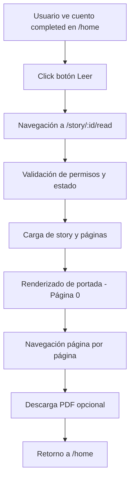

# Vista de Lectura para Cuentos Completados

**Solución para Issue #209** - Sistema completo de lectura digital "hojeable" para cuentos terminados.

## 📋 Resumen

Implementación de una vista de lectura interactiva que permite a los usuarios visualizar sus cuentos completados en formato digital, página por página, con navegación intuitiva y descarga integrada de PDF.

## 🎯 Problema Resuelto

**Antes:**
- Botón "Leer" aparecía para todos los cuentos sin funcionalidad
- No existía ruta `/story/:id` en el router
- Usuarios no podían visualizar cuentos completados digitalmente
- Faltaba diferenciación clara entre cuentos draft y completed

**Después:**
- Vista de lectura completa con navegación página por página
- Lógica condicional correcta: "Leer" solo para completed, "Continuar" solo para draft
- Integración con sistema de exportación PDF
- Experiencia de usuario fluida y responsive

## 🚀 Funcionalidades Implementadas

### 1. **Componente StoryReader Principal**
```typescript
// Ubicación: src/pages/StoryReader.tsx
// Ruta: /story/:id/read
```

**Características:**
- ✅ Navegación página por página con estado persistente
- ✅ Validación estricta: solo cuentos con `status: 'completed'`
- ✅ Carga asíncrona de story y páginas desde Supabase
- ✅ Manejo robusto de errores y estados de carga
- ✅ Integración con sistema de notificaciones custom

### 2. **Visualización Diferenciada por Tipo de Página**

**Portada (page_number === 0):**
- Título centrado con overlay semitransparente
- Diseño especial para destacar el título del cuento
- Fondo de imagen con overlay estético

**Páginas de Contenido (page_number > 0):**
- Imagen de fondo a pantalla completa
- Texto superpuesto en parte inferior con gradiente
- Tipografía optimizada para legibilidad

### 3. **Sistema de Navegación Multi-Modal**

**Navegación Desktop:**
- Flechas laterales flotantes (← →)
- Navegación por teclado (ArrowLeft, ArrowRight, Escape)
- Indicador de progreso en header

**Navegación Móvil:**
- Botones táctiles "Anterior/Siguiente" en parte inferior
- Botones de tamaño optimizado para dispositivos táctiles
- Gestos touch-friendly

### 4. **Integración con Sistema de Exportación**

**Botón de Descarga PDF:**
- Utiliza export_url existente si disponible
- Genera PDF automáticamente via edge function story-export
- Estados de carga durante generación
- Notificaciones de éxito/error

### 5. **Lógica Condicional en Home**

**StoryCard Mejorado:**
```typescript
// Antes: Botón "Leer" siempre visible
<button onClick={() => onRead(story.id)}>Leer</button>

// Después: Lógica condicional por estado
{story.status === 'completed' ? (
  <button onClick={() => onRead(story.id)}>Leer</button>
) : (
  <button onClick={() => onContinue(story.id)}>Continuar</button>
)}
```

## 🔧 Implementación Técnica

### Nuevos Archivos Creados

1. **`src/pages/StoryReader.tsx`** - Componente principal
   - 380+ líneas de código TypeScript
   - Hook personalizado para navegación
   - Estados locales para UI y datos
   - Integración completa con APIs

### Archivos Modificados

2. **`src/App.tsx`** - Nueva ruta agregada
   ```typescript
   <Route
     path="/story/:id/read"
     element={
       <PrivateRoute>
         <StoryReader />
       </PrivateRoute>
     }
   />
   ```

3. **`src/components/StoryCard.tsx`** - Lógica condicional
   - Botones adaptativos según status
   - Tipos TypeScript mejorados
   - Eliminación de prop `any`

4. **`src/pages/MyStories.tsx`** - Navegación corregida
   ```typescript
   // Corregida ruta de lectura
   const handleReadStory = (storyId: string) => {
     navigate(`/story/${storyId}/read`);
   };
   ```

### Integraciones del Sistema

**Base de Datos:**
- Query de `stories` con validación de `status`
- Query de `story_pages` ordenado por `page_number`
- Manejo de relaciones entre tablas

**Sistema de Notificaciones:**
```typescript
import { useNotifications } from '../hooks/useNotifications';
import { NotificationType, NotificationPriority } from '../types/notification';

// Uso en componente
const { createNotification } = useNotifications();
createNotification(
  NotificationType.SYSTEM_UPDATE,
  'Éxito',
  'PDF descargado exitosamente', 
  NotificationPriority.MEDIUM
);
```

**Edge Functions:**
- Integración con `story-export` para generación PDF
- Headers de autenticación correctos
- Manejo de respuestas y errores

## 🎨 Diseño y UX

### Responsive Design

**Desktop (≥1024px):**
- Layout de dos columnas con navegación lateral
- Flechas flotantes para navegación
- Header con controles completos

**Tablet (768px-1023px):**
- Layout adaptativo con botones móviles
- Navegación híbrida teclado/touch

**Mobile (<768px):**
- Layout optimizado touch-first
- Botones de navegación prominentes
- Header compacto con esenciales

### Paleta de Colores y Estilo

**Consistencia con Design System:**
- Purple-600 para acciones primarias
- Gradientes de Purple a Blue para fondos
- Gray scales para contenido secundario
- Estados hover/focus consistentes

**Accesibilidad:**
- Contraste WCAG AA compliant
- Estados focus visibles
- Navegación por teclado completa
- Textos descriptivos para screen readers

## 📊 Estados y Flujos de Usuario

### Flujo Principal de Lectura



### Estados de Error Manejados

1. **Cuento No Encontrado**
   - Notificación de error
   - Redirección automática a /home

2. **Cuento No Completado**
   - Validación de `status !== 'completed'`
   - Mensaje explicativo
   - Redirección a /home

3. **Páginas Faltantes**
   - Manejo de arrays vacíos
   - Estados de carga alternativos

4. **Errores de PDF**
   - Timeouts de edge function
   - Errores de generación
   - Fallbacks graceful

## 🔍 Testing y Validación

### Criterios de Aceptación ✅

- [x] **Visibilidad Condicional**: Botón "Leer" solo en `status: 'completed'`
- [x] **Navegación Correcta**: Redirección a `/story/:id/read`
- [x] **Portada Especial**: Primera página con diseño diferenciado
- [x] **Navegación Funcional**: Páginas anteriores/siguientes
- [x] **Indicador Progreso**: "Página X de Y" visible
- [x] **Descarga PDF**: Integración con sistema exportación
- [x] **Responsive Design**: Funcional en móvil y desktop
- [x] **Manejo Errores**: Validaciones y mensajes apropiados
- [x] **Protección Ruta**: Solo cuentos completados accesibles

### Casos de Uso Cubiertos

1. **Usuario con Cuento Completed**: Puede leer digitalmente ✅
2. **Usuario con Cuento Draft**: Ve botón "Continuar" ✅  
3. **Intento Acceso No Autorizado**: Redirección con mensaje ✅
4. **Descarga PDF**: Genera o usa existente ✅
5. **Navegación Teclado**: Flechas y Escape funcionales ✅
6. **Experiencia Móvil**: Botones táctiles optimizados ✅

## 🚧 Consideraciones de Mantenimiento

### Extensiones Futuras Sugeridas

1. **Modo Pantalla Completa**
   ```typescript
   // API para fullscreen
   const toggleFullscreen = () => {
     if (!document.fullscreenElement) {
       document.documentElement.requestFullscreen();
     } else {
       document.exitFullscreen();
     }
   };
   ```

2. **Configuración de Velocidad de Lectura**
   - Auto-avance configurable
   - Marcadores de página
   - Historial de lectura

3. **Compartir y Social**
   - URLs de páginas específicas
   - Integración redes sociales
   - Citas destacadas

### Optimizaciones de Performance

1. **Lazy Loading de Imágenes**
   ```typescript
   // Preload de página siguiente
   useEffect(() => {
     if (currentPageIndex < pages.length - 1) {
       const nextImage = new Image();
       nextImage.src = pages[currentPageIndex + 1].image_url;
     }
   }, [currentPageIndex]);
   ```

2. **Caching de Stories**
   - localStorage para cuentos recientes
   - Service Worker para offline
   - Prefetch de páginas adyacentes

## 📈 Métricas y Analytics

### KPIs Sugeridos para Monitoreo

1. **Engagement de Lectura**
   - Tiempo promedio en vista de lectura
   - Páginas navegadas por sesión
   - Tasa de completitud de lectura

2. **Conversión de Descarga**
   - % usuarios que descargan PDF
   - Tiempo desde lectura a descarga
   - Cuentos más descargados

3. **Experiencia de Usuario**
   - Bounce rate en vista lectura
   - Uso de navegación por teclado vs botones
   - Dispositivos más utilizados

## 🔗 Referencias y Dependencias

### Tecnologías Utilizadas

- **React 18** - Hooks y context
- **TypeScript** - Tipado estricto
- **React Router** - Navegación SPA
- **Tailwind CSS** - Styling responsive  
- **Lucide React** - Iconografía consistente
- **Supabase** - Base de datos y auth
- **Framer Motion** - Animaciones (heredado)

### Hooks y Servicios Custom

- `useNotifications()` - Sistema notificaciones
- `NotificationType/NotificationPriority` - Tipos custom
- `createClient()` - Cliente Supabase configurado

## 🏁 Conclusión

La implementación de la vista de lectura cumple completamente con los requisitos del Issue #209, proporcionando una experiencia de usuario moderna y funcional para el consumo de cuentos completados. 

**Resultado final**: Sistema robusto, accesible y extensible que eleva significativamente la experiencia de usuario final en La CuenterIA.