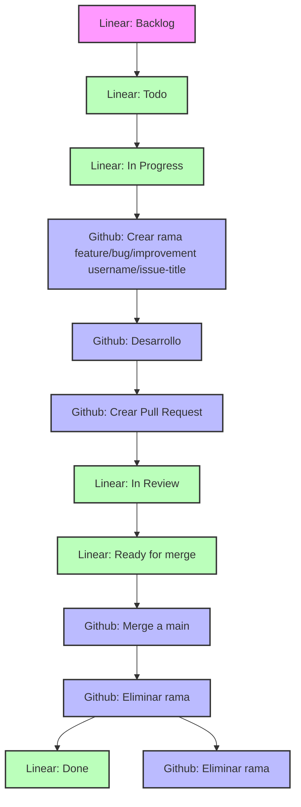

# 🧭 Modo de Trabajo con GitFlow y Linear

Este documento define la metodología de trabajo que utilizaremos para organizar nuestras tareas y versionar nuestro código. Se basa en el uso de **issues en Linear** y **ramas en GitHub**, con un flujo de trabajo claro y estructurado.

---

## 📌 Estados de Issues en Linear

| Estado              | Descripción                                                                 |
|---------------------|-----------------------------------------------------------------------------|
| **Backlog**         | Ideas, requerimientos o tareas sin priorización ni planificación.           |
| **Todo**            | Tareas priorizadas listas para ser tomadas en la próxima iteración.         |
| **In Progress**     | Tareas que están siendo desarrolladas activamente.                          |
| **In Review**       | Tareas con código subido, esperando revisión (Pull Request abierto).        |
| **Ready for merge** | Código aprobado, pendiente de merge a `main`.                               |
| **Done**            | Tareas completamente terminadas y desplegadas (si aplica).                  |
| **Canceled**        | Tareas que se descartan por cualquier motivo.                               |

---

## 🌱 Convención de Ramas en GitHub

| Rama              | Propósito                                                   |
|-------------------|-------------------------------------------------------------|
| `main`            | Rama principal. Código estable y listo para producción.     |
| `feature/*`       | Nuevas funcionalidades.                                     |
| `improvement/*`   | Mejoras no funcionales, refactor, rendimiento, etc.         |
| `bug/*`           | Corrección de errores o regresiones detectadas.             |

> 💡 Cada issue de Linear debe tener su rama asociada.

**Ejemplos:**
- `feature/formulario-login`
- `improvement/ajuste-carga`
- `bug/fix-crash-navegador`

---

## 🔁 Flujo de Trabajo Integrado

### 1. Desde Linear
- Se planifican issues desde **Backlog** hacia **Todo**.
- Cada issue debe tener:
  - Contexto.
  - Objetivo claro.
  - Criterios de éxito y QA.

### 2. Inicio de Desarrollo
- Al mover un issue a **In Progress**:
  - Crear una nueva rama desde `main`.
  - Nombrar la rama según el tipo (`feature/`, `bug/`, etc.).
  - Asociar el issue en los commits o en la Pull Request.

### 3. Pull Request
- Al finalizar el desarrollo:
  - Subir la rama y abrir una Pull Request hacia `main`.
  - Mover el issue a **In Review**.
  - Solicitar revisión a un compañero.

### 4. Merge y Cierre
- Una vez aprobada la PR:
  - Mover el issue a **Ready for merge**.
  - Hacer merge a `main`.
  - Eliminar la rama.
  - Mover el issue a **Done**.

---

## ✅ Buenas Prácticas

- Una rama = un issue.
- Pull Requests claras: qué se hizo, por qué, y cómo probarlo.
- Eliminar ramas después del merge.
- Si el issue no se ejecutará, mover a **Canceled**.

---

## ❓ Preguntas Frecuentes

### ¿Se pierde el historial al borrar una rama?
No. Siempre que hayas hecho merge a `main`, los commits **persisten en el historial**. Lo que se borra es solo el “puntero” de la rama. Aún podrás ver:

- Commits en `git log`.
- Cambios en `git blame`.
- PRs en GitHub.

> ⚠️ Solo pierdes el historial si haces `squash` sin guardar la info, o borras una rama **sin** mergearla.

---
