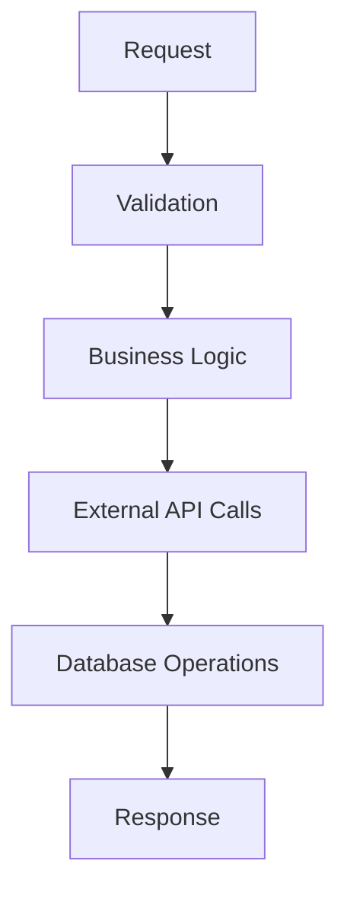

# Edge Function: [function-name]

## 📋 Descripción
Descripción general de la Edge Function, su propósito y lugar en la arquitectura.

## 🎯 Funcionalidades
- **Funcionalidad 1**: Descripción específica
- **Funcionalidad 2**: Descripción específica
- **Funcionalidad 3**: Descripción específica

## 📡 API

### Endpoint
```
POST/GET /functions/v1/function-name
```

### Request Interface
```typescript
interface RequestBody {
  param1: string;
  param2?: number;
  options?: {
    option1: boolean;
    option2: string;
  };
}
```

### Response Interface
```typescript
interface ResponseBody {
  success: boolean;
  data?: any;
  error?: string;
  metadata?: {
    timing: number;
    version: string;
  };
}
```

## 🔐 Autenticación
- **JWT Required**: Sí/No
- **Permissions**: Lista de permisos necesarios
- **Rate Limiting**: Límites aplicados

## 🔄 Flujo de Procesamiento

### 1. Validación
- Validación de JWT
- Validación de parámetros
- Verificación de permisos

### 2. Procesamiento Principal


### 3. Manejo de Errores
- **Error 400**: Parámetros inválidos
- **Error 401**: No autorizado
- **Error 500**: Error interno

## 🗄️ Dependencias

### External APIs
- **API 1**: Propósito y configuración
- **API 2**: Propósito y configuración

### Database Tables
- `table_name` - Operaciones realizadas
- `another_table` - Operaciones realizadas

### Shared Utilities
- `_shared/utility1.ts` - Funcionalidad utilizada
- `_shared/utility2.ts` - Funcionalidad utilizada

## ⚡ Performance

### Métricas Típicas
- **Response Time**: X ms promedio
- **Timeout**: X segundos
- **Memory Usage**: X MB promedio

### Optimizaciones
- Caching implementado
- Conexiones reutilizadas
- Procesamiento asíncrono

## 📊 Logging y Métricas

### Métricas Registradas
```typescript
await logPromptMetric({
  modelo_ia: 'model-name',
  tiempo_respuesta_ms: elapsed,
  estado: 'success' | 'error',
  tokens_entrada: inputTokens,
  tokens_salida: outputTokens,
  usuario_id: userId,
  actividad: 'activity-name',
  edge_function: 'function-name'
});
```

### Logs Importantes
- Request/Response logging
- Error details
- Performance metrics
- Business events

## 🧪 Testing

### Unit Tests
```bash
# Comando para ejecutar tests
deno test supabase/functions/function-name/
```

### Integration Tests
- Test con base de datos
- Test con APIs externas
- Test de autenticación

### Manual Testing
```bash
# Ejemplo de llamada manual
curl -X POST \
  -H "Authorization: Bearer <token>" \
  -H "Content-Type: application/json" \
  -d '{"param1": "value"}' \
  https://your-project.supabase.co/functions/v1/function-name
```

## 🚀 Deployment

### Environment Variables
```env
VARIABLE_1=description
VARIABLE_2=description
SUPABASE_SERVICE_ROLE_KEY=required
```

### Deploy Command
```bash
supabase functions deploy function-name
```

### Post-Deployment Verification
- [ ] Function appears in Supabase dashboard
- [ ] Health check passes
- [ ] Metrics are being recorded
- [ ] Error handling works correctly

## 🔧 Configuration

### Supabase Config
```toml
[functions.function-name]
enabled = true
verify_jwt = true
import_map = "./import_map.json"
```

### Import Map
```json
{
  "imports": {
    "dependency": "npm:package@version"
  }
}
```

## 🐛 Troubleshooting

### Common Issues
1. **Issue**: Error message or symptom
   - **Cause**: Probable cause
   - **Solution**: How to fix

2. **Issue**: Another error message
   - **Cause**: Probable cause  
   - **Solution**: How to fix

### Debugging
- Check Supabase logs dashboard
- Verify environment variables
- Test with simplified payload
- Check network connectivity

## 📝 Changelog
- **v1.0.0**: Initial implementation
- **v1.1.0**: Added feature X
- **v1.2.0**: Performance improvements